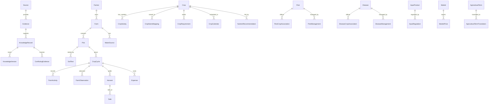

# Data Model — Complete Entity Reference

**Version:** 0.1.0
**Date:** 2026-09-30

---

## Entity Relationship Diagram

## Entity Catalog

### Evidence System (5 entities)

| Entity | Purpose | Key Fields |
|--------|---------|------------|
| **Source** | Institutional publisher | name, authority_level, license_band, url |
| **Evidence** | Specific claim from a source | claim_text, geographic_applicability, observation_type, conditions |
| **KnowledgeRecord** | Structured agricultural fact | category, content (JSONB), conditions, confidence, evidence_id |
| **KnowledgeVersion** | Change audit trail | version_number, change_reason, previous_content |
| **ConflictingEvidence** | Documented disagreement | conflict_type, resolution_status, conditions_differ |

### Farm Digital Twin (5 entities)

| Entity | Purpose | Key Fields |
|--------|---------|------------|
| **Farmer** | Farm owner/operator | name, phone_hash, preferred_language |
| **Farm** | Physical farm | location (Point), boundary (Polygon), area, survey_number, village_code |
| **Plot** | Subdivision of farm | boundary, soil_type, irrigation_type, water_source |
| **SoilTest** | Laboratory soil analysis | ph, ec, oc, N, P, K, micronutrients, shc_id, data_provenance |
| **WaterSource** | Irrigation source | type (BOREWELL/WELL/CANAL/RAINFED), depth, discharge, quality |

### Crop Knowledge (4 entities)

| Entity | Purpose | Key Fields |
|--------|---------|------------|
| **Crop** | Canonical crop definition | canonical_name, scientific_name, crop_type, crop_group |
| **CropVariety** | Released variety | variety_name, released_by, duration_days, season, characteristics |
| **CropRequirement** | Growing conditions | parameter, min_value, max_value, unit, condition (JSONB) |
| **CropCalendar** | Sowing/harvest windows | zone, season, sowing months, harvest months |

### Crop Cycle / Farm Diary (5 entities)

| Entity | Purpose | Key Fields |
|--------|---------|------------|
| **CropCycle** | One season of one crop on one plot | crop, variety, sowing_date, status |
| **FarmActivity** | Work done on the plot | activity_type, activity_date, input_product, cost |
| **FarmObservation** | Field observations | category, description, severity, photo_url |
| **Harvest** | Yield data | harvest_date, quantity_kg, quality_grade |
| **Sale** | Market transaction | market_name, price_per_kg, transport_cost, commission |
| **Expense** | Cost tracking | category, amount, expense_date |

### Nutrient (1 entity)

| Entity | Purpose | Key Fields |
|--------|---------|------------|
| **NutrientRecommendation** | NPK doses with conditions | n, p2o5, k2o, soil_type, irrigation_status, zone, evidence_id |

### Pest & Disease (6 entities)

| Entity | Purpose | Key Fields |
|--------|---------|------------|
| **Pest** | Pest organism | canonical_name, scientific_name, pest_type |
| **Disease** | Plant disease | canonical_name, scientific_name, causal_agent |
| **PestCropAssociation** | Which pests affect which crops | severity, season, geographic_scope |
| **DiseaseCropAssociation** | Which diseases affect which crops | severity, season, geographic_scope |
| **PestManagement** | How to manage pests | management_type, active_ingredient, dose, phi_days |
| **DiseaseManagement** | How to manage diseases | management_type, active_ingredient, dose, phi_days |

### Regulatory (2 entities)

| Entity | Purpose | Key Fields |
|--------|---------|------------|
| **InputProduct** | Agricultural chemical product | active_ingredient, formulation, cibrc_registration_number |
| **InputRegulation** | Legal status of a product | regulatory_status, applicable_crops, applicable_pests |

### Market (2 entities)

| Entity | Purpose | Key Fields |
|--------|---------|------------|
| **Market** | Physical market/APMC | name, location (Point), district, agmarknet_code |
| **MarketPrice** | Daily price record | commodity, variety, min/max/modal price, price_date |

### Weather (1 entity)

| Entity | Purpose | Key Fields |
|--------|---------|------------|
| **WeatherObservation** | Weather data point | location, date, temperature, rainfall, humidity, ET0, provider |

### Multilingual (2 entities)

| Entity | Purpose | Key Fields |
|--------|---------|------------|
| **AgriculturalTerm** | Canonical agricultural concept | canonical_key, english_term, category |
| **AgriculturalTermTranslation** | Translation of a term | language_code, translated_term, script, romanized, verified |

---

## Total: 34 entities across 9 domains

## Data Provenance (applied to all farm-entered data)

Every piece of farm data carries a `data_provenance` tag:

| Tag | Trust Level | Example |
|-----|------------|---------|
| `FARMER_ENTERED` | Self-reported | "I planted groundnut on June 15" |
| `FARM_MEASURED` | Measured at farm | Soil test result, GPS boundary walk |
| `GOVERNMENT_DATA` | Official government | Census, CIB&RC, DES |
| `SCIENTIFIC_DATASET` | Published research | NBSS soil series, Kumar Naik 2020 |
| `SATELLITE_DERIVED` | Remote sensing | NDVI, estimated land cover |
| `MODEL_DERIVED` | Computational model | NASA POWER weather, SoilGrids |
| `REGIONAL_INFERENCE` | Applied from broader geography | Zone IV calendar used for village |
| `DEMO_ONLY` | Demonstration — NOT real | Any demo farm data |
